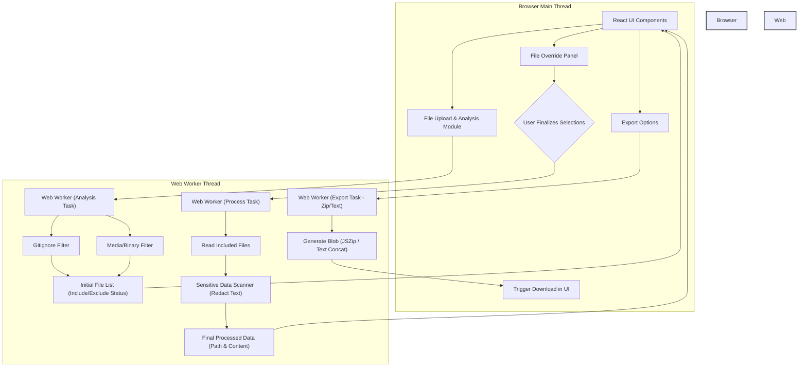

# CodeCleanse ✨🧹

[](./package.json) 
[](https://github.com/enkosi-ventures/codecleanse/actions/workflows/ci.yml)
[](https://opensource.org/licenses/MIT)
<a href="https://www.buymeacoffee.com/enkosi" target="_blank"></a>

Securely clean your code repositories for Large Language Model (LLM) submission, right in your browser.

## What is CodeCleanse?

CodeCleanse is a front-end–only web application designed to prepare source code repositories for submission to Large Language Models (like GPT, Claude, Gemini, etc.). When submitting code to LLMs, you often want to:

1.  **Protect Sensitive Information:** Avoid leaking API keys, credentials, or other secrets.
2.  **Exclude Unnecessary Files:** Remove binaries, media files, build artifacts, dependency directories (`node_modules`), and cache files that waste tokens and provide no useful context.
3.  **Respect `.gitignore`:** Automatically exclude files that are typically ignored in version control.
4.  **Control the Output:** Package the cleaned code conveniently as a ZIP archive or a single concatenated text file.

CodeCleanse does all of this **entirely within your web browser**. No code is uploaded to any server, maximizing privacy and security.

## Key Features

*   🔒 **Client-Side Processing:** All analysis, filtering, and redaction happen locally in your browser. Your code never leaves your machine.
*    G **Gitignore Filtering:** Automatically detects and applies rules from `.gitignore` files found in your project (toggleable). Also includes standard ignores (like `.git/`).
*   🗑️ **Smart Filtering:** Removes common binary files (images, audio, video, archives), build outputs (`dist/`, `build/`), dependency caches (`node_modules/`, `vendor/`), and other non-essential files based on common patterns and extensions.
*   🛡️ **Sensitive Data Redaction:** Uses regular expressions to find common patterns for API keys, tokens, and credentials, replacing them with a configurable placeholder (e.g., `[REDACTED]`).
*   ✍️ **Manual Override:** Provides a file tree view allowing you to review the initially included/excluded files and manually toggle their inclusion status before final processing.
*   📦 **Flexible Export:** Download the cleaned repository as a ZIP archive (preserving directory structure) or as a single concatenated text file with file path annotations.
*   ⚡ **Responsive UI:** Built with React and Material UI, using Web Workers to perform heavy processing tasks without freezing the main browser thread.
*   📢 **Light Ad Integration:** Includes unobtrusive placeholders for potential ad integration (e.g., for promoting other tools or via ad networks), clearly separated from the core functionality.

## How It Works (Architecture)

CodeCleanse leverages modern web technologies to perform all operations client-side:

1.  **Upload:** The user selects a project folder using the file input (which supports directory uploads via `webkitdirectory`) or drag-and-drop.
2.  **Analysis (Web Worker):**
    *   The selected files are sent to a Web Worker thread.
    *   The worker reads the `.gitignore` file (if present and enabled).
    *   It iterates through all files, applying `.gitignore` rules and filtering out common binaries, media, and cache directories/files based on paths and extensions.
    *   It performs an *initial* classification (include/exclude) and gathers statistics (file counts, size).
    *   *Note: Sensitive data scanning happens in the next step to avoid reading all file contents upfront.*
    *   The analysis result (list of files with their initial status) is sent back to the main thread.
3.  **Review & Configuration (UI):**
    *   The main thread displays the analysis summary and the list of files.
    *   The user can configure options (use gitignore, redaction placeholder).
    *   Crucially, the user can use the **File Override Panel** to manually toggle the inclusion status of any file, overriding the automatic decision.
4.  **Processing (Web Worker):**
    *   When the user clicks "Process Files", the list of files (including their final inclusion status based on automatic analysis + user overrides) and the configuration are sent back to the Web Worker.
    *   The worker reads the content **only** for the files marked for final inclusion.
    *   For text files, it applies the sensitive data scanner (regex) and redacts any findings.
    *   Binary files that were manually included are kept as `ArrayBuffer`s.
    *   The worker compiles the final list of file paths and their processed content.
5.  **Export (Web Worker / Main Thread):**
    *   The user chooses an export format (ZIP or Text).
    *   A task is sent to the worker with the processed data.
    *   The worker uses `JSZip` to create the zip blob or concatenates text content into a single string/blob.
    *   The resulting blob is sent back to the main thread.
    *   The main thread triggers a file download for the user.

**Core Technologies:**

*   **React:** For building the user interface components.
*   **TypeScript:** For static typing and improved code quality.
*   **Vite:** As the fast build tool and development server.
*   **Material UI:** For pre-built UI components and styling.
*   **Web Workers:** To run file analysis and processing off the main thread, keeping the UI responsive.
*   **JSZip:** For creating ZIP archives in the browser.
*   **Micromatch:** For processing `.gitignore` patterns effectively.

**Architecture Diagram:**

<details>
<summary>Click to view Architecture Diagram</summary>



</details>

## Getting Started (Usage)

1.  **Visit the Application:** Open the deployed CodeCleanse application in your web browser.
    *   *(Link will be added here when deployed, e.g., via GitHub Pages)*
2.  **Upload Your Code:** Drag and drop your project's root folder onto the designated area, or click "Browse Folder" to select it.
3.  **Wait for Analysis:** The application will analyze your files. This may take a few moments for larger projects. A progress indicator will be shown.
4.  **Review & Override:** Once analysis is complete, examine the "Initial Analysis" summary. Go to the "Review Files" panel which lists all detected files.
    *   Files marked with ✅ are initially included.
    *   Files marked with ❌ are initially excluded (due to gitignore, binary type, etc.).
    *   Click the eye icon (👁️ / 👁️‍🗨️) next to any file to **toggle** its inclusion status. A blue eye icon indicates a manual override is active for that file. Use the tooltips for more details.
5.  **Configure:** Adjust settings in the "Upload & Configure" panel if needed (e.g., disable `.gitignore` processing, change the redaction text).
6.  **Process:** Click the "Process Files" button. The application will read the content of included files and perform redaction in the Web Worker.
7.  **Export:** Once processing is complete, click either "Export as ZIP" or "Export as Text" to download the cleaned results.

## Development Setup

Want to run CodeCleanse locally or contribute? Follow these steps:

**Prerequisites:**

*   [Node.js](https://nodejs.org/) (Version >= 18 recommended, check `.nvmrc` if present)
*   [npm](https://www.npmjs.com/) (usually included with Node.js) or [yarn](https://yarnpkg.com/)

**Steps:**

1.  **Clone the Repository:**
    ```bash
    git clone https://github.com/enkosi-ventures/codecleanse.git
    cd codecleanse
    ```

2.  **Install Dependencies:**
    ```bash
    npm install
    # or if using yarn:
    # yarn install
    # or for reproducible CI builds:
    # npm ci
    ```

3.  **Run the Development Server:**
    ```bash
    npm run dev
    # or
    # yarn dev
    ```
    This will start Vite's development server, typically available at `http://localhost:5173`. The application will auto-reload when you make changes.

4.  **Running Tests:**
    *   Run tests once in the console:
        ```bash
        npm run test -- --run
        ```
    *   Run tests in watch mode:
        ```bash
        npm run test
        ```
    *   Run tests with the Vitest UI:
        ```bash
        npm run test:ui
        ```
    *   Run tests with coverage (if configured):
        ```bash
        npm run coverage
        ```

5.  **Linting:**
    ```bash
    npm run lint
    ```

6.  **Building for Production:**
    ```bash
    npm run build
    ```
    This creates an optimized static build in the `dist/` directory. You can preview the build locally using `npm run preview`. The contents of `dist/` can be deployed to any static web host (like GitHub Pages, Netlify, Vercel).

## Contributing 🤝

Contributions are welcome! Whether it's bug reports, feature suggestions, or code contributions, please feel free to participate.

1.  **Fork** the repository.
2.  Create a new **branch** for your feature or fix: `git checkout -b feat/my-new-feature` or `git checkout -b fix/issue-123`.
3.  Make your changes.
4.  **Add tests** for your changes.
5.  Ensure all tests pass: `npm run test -- --run`.
6.  Ensure code style consistency: `npm run lint`.
7.  Commit your changes with clear messages.
8.  Push your branch to your fork.
9.  Submit a **Pull Request** to the main repository's `main` branch.

Please open an [issue](https://github.com/enkosi-ventures/codecleanse/issues) first to discuss significant changes or new features.

## Found it Useful? Buy Me a Coffee! ☕

If CodeCleanse helped you out, consider supporting its development by buying me a coffee!

<a href="https://www.buymeacoffee.com/enkosi" target="_blank"></a>

## License

This project is licensed under the **MIT License**. See the [LICENSE](LICENSE) file for details.
